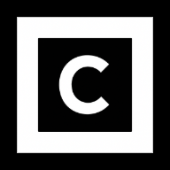

<div align="center">



# colleKT

**A cutting-edge 3D NFT gallery experience for the Tezos ecosystem**

[](LICENSE)
[](https://nextjs.org/)
[](https://docs.pmnd.rs/react-three-fiber)
[](https://www.typescriptlang.org/)
[](https://vercel.com/)

[](https://vercel.com/new/clone?repository-url=https%3A%2F%2Fgithub.com%2Fskullzarmy%2FcolleKT&env=CACHE_ENABLED,CACHE_TTL_SECONDS,UPSTASH_REDIS_REST_TOKEN,UPSTASH_REDIS_REST_URL&envDescription=To%20enable%20API%20response%20caching%2C%20provide%20Upstash%20credentials%20and%20cache%20settings&project-name=my-3d-gallery&repository-name=my-3d-gallery)

[Live Demo](https://collekt.fafolab.xyz) • [Features](#features) • [Getting Started](#getting-started) • [API](#api-documentation) • [Contributing](#contributing)

</div>

## Overview

colleKT is an immersive 3D gallery platform that transforms how users explore and interact with Tezos NFT collections. Built with cutting-edge web technologies, it provides a museum-quality experience for viewing NFTs in beautifully rendered 3D environments.

### 🎯 What makes colleKT special?

-   **Immersive 3D Experience**: Walk through virtual galleries with realistic lighting and physics
-   **Multi-Gallery Support**: View user collections, curated galleries, and contract-based collections
-   **Smart Input Parsing**: Enter Tezos addresses, domains, objkt.com URLs, or contract addresses
-   **Responsive Design**: Seamless fallback to 2D mode on mobile devices
-   **Performance Optimized**: Intelligent texture preloading and caching for smooth navigation
-   **Open Source**: Built with modern web standards and fully extensible

## Features

### 🎨 Gallery Types

| Type                     | Description                                 | Example Input                          |
| ------------------------ | ------------------------------------------- | -------------------------------------- |
| **User Gallery**         | Personal NFT collections by wallet address  | `tz1Qi77tcJn9foeHHP1QHj6UX1m1vLVLMbuY` |
| **Tezos Domains**        | Human-readable domain resolution            | `skllzrmy.tez`                         |
| **Curated Galleries**    | objkt.com curations with themed collections | `b264a749-2674-4baa-bc7c-b5ed8bafe54a` |
| **Contract Collections** | Entire NFT contract collections             | `KT1VLVcGTw6UkwzMiPAn8SNcoMjicitQBGF6` |

### 🎮 Interactive Features

-   **Walk Mode**: First-person navigation through gallery spaces
-   **Overview Mode**: Bird's-eye view for quick collection browsing
-   **Room-based Layout**: Automatic pagination with 20 NFTs per room
-   **Smart Art Arrangement**: Dynamic wall positioning based on aspect ratios
-   **Media Modal**: Detailed NFT viewing with metadata display
-   **Texture Preloading**: Smooth navigation with background asset loading

### 🛠 Technical Highlights

-   **React Three Fiber**: Hardware-accelerated 3D rendering
-   **Next.js 15**: Modern React framework with App Router
-   **TypeScript**: Full type safety and developer experience
-   **TzKT API Integration**: Reliable Tezos blockchain data
-   **Intelligent Caching**: Redis-powered performance optimization
-   **Mobile Responsive**: Graceful degradation to 2D mode
-   **Error Boundaries**: Robust error handling and fallbacks

## Getting Started

### Prerequisites

-   Node.js 18+ or Bun
-   npm, yarn, pnpm, or bun package manager

### Installation

1. **Clone the repository**

    ```bash
    git clone https://github.com/skullzarmy/colleKT.git
    cd colleKT
    ```

2. **Install dependencies**

    ```bash
    # Using npm
    npm install

    # Using yarn
    yarn install

    # Using pnpm
    pnpm install

    # Using bun
    bun install
    ```

3. **Set up environment variables**

    ```bash
    cp .env.example .env.local
    ```

    Configure the following variables:

    ```env
    # Redis for caching (optional, falls back to memory cache)
    UPSTASH_REDIS_REST_URL=your_redis_url
    UPSTASH_REDIS_REST_TOKEN=your_redis_token

    # Application URL
    NEXT_PUBLIC_APP_URL=http://localhost:3000
    ```

4. **Run the development server**

    ```bash
    npm run dev
    # or
    yarn dev
    # or
    pnpm dev
    # or
    bun dev
    ```

5. **Open your browser**
   Navigate to [http://localhost:3000](http://localhost:3000) to see the application.

## Usage

### Basic Navigation

1. **Enter a gallery identifier** on the home page:

    - Tezos wallet address: `tz1...`
    - Tezos domain: `yourname.tez`
    - objkt.com curation URL or ID
    - NFT contract address: `KT1...`

2. **Explore the 3D gallery**:

    - Use WASD keys or arrow keys to walk around
    - Mouse to look around
    - Click on NFTs to view details
    - Use room navigation to move between pages

3. **Switch viewing modes**:
    - Walk mode for immersive exploration
    - Overview mode for quick browsing
    - 2D mode fallback on mobile devices

### URL Structure

colleKT supports direct linking to specific galleries and pages:

```
# User galleries
/gallery/tz1Qi77tcJn9foeHHP1QHj6UX1m1vLVLMbuY
/gallery/skllzrmy.tez/page/2

# Curated galleries
/curation/b264a749-2674-4baa-bc7c-b5ed8bafe54a

# Contract collections
/collection/KT1VLVcGTw6UkwzMiPAn8SNcoMjicitQBGF6/page/3
```

## API Documentation

colleKT provides RESTful APIs for programmatic access to gallery data.

### Endpoints

#### User Collections

```http
GET /api/user?address=tz1...&page=1&pageSize=20&forceRefresh=false
```

#### Curated Galleries

```http
GET /api/curation?curationId=b264a749&page=1&pageSize=20&forceRefresh=false
```

#### Contract Collections

```http
GET /api/collection?contractAddress=KT1...&page=1&pageSize=20&forceRefresh=false
```

### Response Format

```json
{
  "success": true,
  "data": {
    "tokens": [...],
    "pagination": {
      "page": 1,
      "pageSize": 20,
      "totalItems": 150,
      "totalPages": 8
    },
    "cacheInfo": {
      "hit": true,
      "source": "redis",
      "buildTimeMs": 245
    },
    "performance": {
      "totalTimeMs": 267,
      "fetchTimeMs": 189,
      "filterTimeMs": 12
    }
  }
}
```

## Architecture

### Tech Stack

-   **Frontend**: Next.js 15, React 18, TypeScript
-   **3D Rendering**: React Three Fiber, Three.js, Drei
-   **Styling**: Tailwind CSS, Radix UI Components
-   **Data Sources**: TzKT API, objkt.com GraphQL
-   **Caching**: Upstash Redis, In-memory fallback
-   **Deployment**: Vercel, Serverless Functions

### Project Structure

```
colleKT/
├── app/                    # Next.js App Router
│   ├── api/               # API routes
│   ├── gallery/           # User gallery pages
│   ├── curation/          # Curated gallery pages
│   └── collection/        # Contract collection pages
├── components/            # React components
│   ├── gallery/          # 3D gallery components
│   └── ui/               # UI components (shadcn/ui)
├── contexts/             # React contexts
├── hooks/                # Custom React hooks
├── lib/                  # Utilities and data layer
│   └── data/            # Data orchestration
└── public/              # Static assets
```

### Data Flow

1. **Input Parsing**: Smart detection of address types and domains
2. **API Routing**: Appropriate data source selection
3. **Data Orchestration**: Unified token format across sources
4. **Caching Layer**: Redis-first with memory fallback
5. **3D Rendering**: Optimized texture loading and display

## Development

### Scripts

```bash
# Development
npm run dev          # Start development server
npm run build        # Build for production
npm run start        # Start production server
npm run lint         # Run ESLint

# Type checking
npx tsc --noEmit     # Check TypeScript types
```

### Environment Setup

For optimal development experience:

1. **Install recommended VS Code extensions**:

    - TypeScript and JavaScript Language Features
    - Tailwind CSS IntelliSense
    - ES7+ React/Redux/React-Native snippets

2. **Configure your editor** for TypeScript and Tailwind CSS

3. **Set up Redis** for caching (optional but recommended)

### Testing Different Gallery Types

Use these test addresses for development:

```bash
# User galleries
tz1Qi77tcJn9foeHHP1QHj6UX1m1vLVLMbuY  # Active collector
skllzrmy.tez                           # Tezos domain

# Curated galleries
b264a749-2674-4baa-bc7c-b5ed8bafe54a   # Long Story Short by swarleyart

# Contract collections
KT1VLVcGTw6UkwzMiPAn8SNcoMjicitQBGF6   # Example NFT contract
```

## Contributing

We welcome contributions from the community! colleKT is built for creators, by creators.

### How to Contribute

1. **Fork the repository**
2. **Create a feature branch**: `git checkout -b feature/amazing-feature`
3. **Make your changes** and add tests if applicable
4. **Follow the code style**: Run `npm run lint` to check
5. **Commit your changes**: `git commit -m 'Add amazing feature'`
6. **Push to the branch**: `git push origin feature/amazing-feature`
7. **Open a Pull Request**

### Development Guidelines

-   **Code Style**: We use ESLint and Prettier for consistent formatting
-   **TypeScript**: Maintain strong typing throughout the codebase
-   **Component Structure**: Follow the established patterns in `/components`
-   **API Design**: Keep endpoints RESTful and well-documented
-   **Performance**: Consider 3D rendering performance in all changes

### Reporting Issues

When reporting bugs, please include:

-   **Environment**: Browser, OS, device type
-   **Steps to reproduce**: Clear, numbered steps
-   **Expected behavior**: What should happen
-   **Actual behavior**: What actually happened
-   **Screenshots/Videos**: If applicable
-   **Console errors**: Browser developer tools output

#### Writing Good Bug Reports

A good bug report helps us fix issues faster:

```markdown
**Bug Description**
Clear, concise description of the issue.

**Environment**

-   Browser: Chrome 119.0.6045.105
-   OS: macOS 14.1
-   Device: Desktop/Mobile

**Steps to Reproduce**

1. Go to homepage
2. Enter address 'tz1...'
3. Click 'Enter Gallery'
4. See error

**Expected vs Actual**
Expected: Gallery loads normally
Actual: White screen with console error

**Additional Context**

-   Console error: [paste error]
-   Screenshot: [attach if helpful]
```

### Feature Requests

We love hearing your ideas! Please:

1. **Check existing issues** to avoid duplicates
2. **Describe the use case** and problem you're solving
3. **Propose a solution** if you have ideas
4. **Consider implementation** complexity and user impact

## Deployment

### Vercel (Recommended)

Easy way:

[](https://vercel.com/new/clone?repository-url=https%3A%2F%2Fgithub.com%2Fskullzarmy%2FcolleKT&env=CACHE_ENABLED,CACHE_TTL_SECONDS,UPSTASH_REDIS_REST_TOKEN,UPSTASH_REDIS_REST_URL&envDescription=To%20enable%20API%20response%20caching%2C%20provide%20Upstash%20credentials%20and%20cache%20settings&project-name=my-3d-gallery&repository-name=my-3d-gallery)

Manual way:

1. **Connect your repository** to Vercel
2. **Set environment variables** in Vercel dashboard
3. **Deploy** - automatic deployments on main branch

### Docker

```dockerfile
# Build stage
FROM node:18-alpine AS builder
WORKDIR /app
COPY package*.json ./
RUN npm ci
COPY . .
RUN npm run build

# Production stage
FROM node:18-alpine AS runner
WORKDIR /app
COPY --from=builder /app/.next/standalone ./
COPY --from=builder /app/.next/static ./.next/static
COPY --from=builder /app/public ./public

EXPOSE 3000
CMD ["node", "server.js"]
```

### Performance Optimization

For production deployments:

-   **Enable Redis caching** for better performance
-   **Configure CDN** for static assets
-   **Set up monitoring** for API endpoints
-   **Implement rate limiting** if needed

## Roadmap

### Upcoming Features

-   [ ] **VR Support**: WebXR integration for immersive experiences
-   [ ] **Social Features**: Gallery sharing and collaborative curation
-   [ ] **Advanced Filtering**: Search and filter within galleries
-   [ ] **Custom Themes**: Personalized gallery environments
-   [ ] **Multi-chain Support**: Ethereum and other blockchain integration
-   [ ] **Audio Integration**: Background music and spatial audio
-   [ ] **Gallery Analytics**: Visitor metrics and insights

### Long-term Vision

-   **Creator Tools**: Custom gallery builders for artists
-   **Exhibition Mode**: Temporary and permanent digital exhibitions
-   **NFT Interactions**: Enhanced metadata display and utility integration
-   **Community Features**: User profiles and social interactions

## FAQ

**Q: How do I view my own NFT collection?**
A: Enter your Tezos address (starting with tz1, tz2, or tz3) or your .tez domain on the homepage.

**Q: Why doesn't my collection show all NFTs?**
A: Collections are paginated with 20 NFTs per room. Use the room navigation to see all items.

**Q: Can I view someone else's collection?**
A: Yes! Enter any public Tezos address to view their NFT collection.

**Q: What file formats are supported?**
A: Images (JPG, PNG, GIF, WebP), videos (MP4, WebM), and some 3D formats. Unsupported formats show placeholder images.

**Q: How often is the data updated?**
A: Data is cached for performance but automatically refreshes. Use the refresh button to force immediate updates.

## Acknowledgments

-   **Tezos Community**: For the vibrant NFT ecosystem
-   **TzKT Team**: For reliable blockchain data APIs
-   **objkt.com**: For curation data and NFT marketplace
-   **React Three Fiber**: For making 3D web development accessible
-   **Vercel**: For excellent hosting and developer experience
-   **Open Source Community**: For the amazing tools and libraries

## License

This project is licensed under the MIT License - see the [LICENSE](LICENSE) file for details.

### MIT License Summary

You are free to:

-   ✅ Use commercially
-   ✅ Modify and distribute
-   ✅ Include in private projects
-   ✅ Sublicense

Just remember to:

-   📄 Include the original license
-   👥 Give appropriate credit

---

<div align="center">

**Built with ❤️ by [FAFO ~~lab~~](https://fafolab.xyz)**

[Website](https://collekt.vercel.app) • [GitHub](https://github.com/skullzarmy/colleKT) • [Issues](https://github.com/skullzarmy/colleKT/issues) • [Discussions](https://github.com/skullzarmy/colleKT/discussions)

_Attribution appreciated but not required_

</div>
